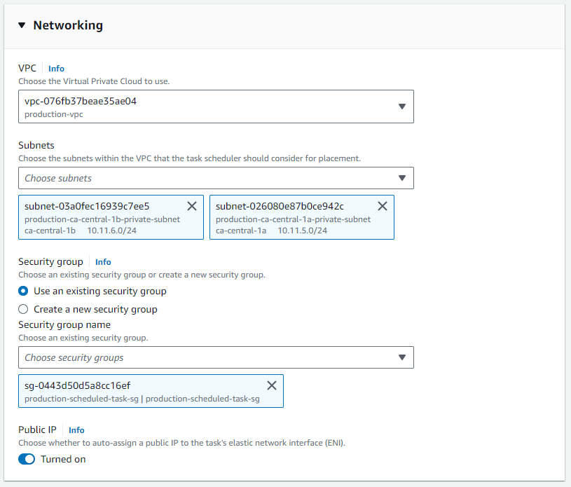
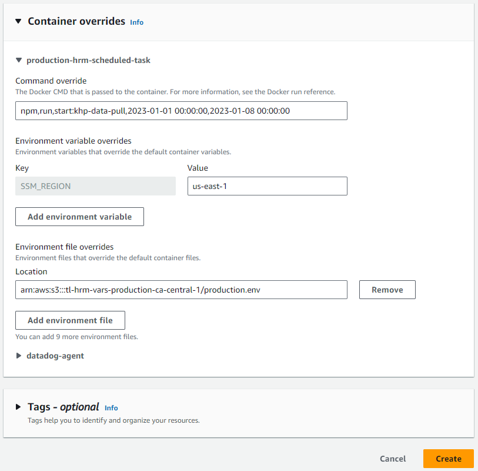

## Manually running the KHP data export from AWS ECS Console

1. Navigate to the AWS Management [Console](https://aws.amazon.com/console/) and login using your credentials.
2. Navigate to Amazon ECS.
3. Ensure you are in the correct region (ca-central-1)
4. Open the `production-ecs-cluster` cluster and view the Tasks tab
5. Go to the 'Scheduled Tasks' tab, open 'production-hrm-scheduled-task-khp-data-pull' and open Schedule target's task definition
6. Click Deploy -> Run Task
7. In the 'Environment' section select `production-ecs-cluster` under 'Existing Cluster'

8. Under 'Networking', select the VPC labelled `production-vpc`. Then select the subnets labelled `production-ca-central-1a-private-subnet` and `production-ca-central-1b-private-subnet`, and the security groups labelled `production-scheduled-task-sg`, `production-hrm-ecs-tasks-sg` and `production-rds-src-sg`.

9. Open 'Container overrides' and set the command override to `npm,run,start:khp-data-pull,{start date in YYYY-MM-DD format},{end date in YYYY-MM-DD format}`, for example `npm,run,start:khp-data-pull,2023-01-01 00:00:00,2023-01-08 00:00:00`
10. Click Create
11. Check the logs in DataDog to ensure the task is running successfully: https://app.datadoghq.com/logs?query=host%3Aproduction-hrm-awslogs%20service%3Acloudwatch%20%40aws.awslogs.logGroup%3Aproduction-hrm-awslogs%20&cols=host%2Cservice&context_event=AYo7YC6hAAAtHltcnORdxQAA&index=%2A&messageDisplay=inline&stream_sort=time%2Cdesc&viz=&live=true